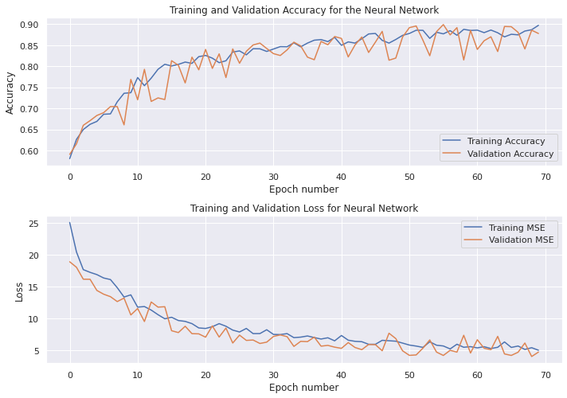
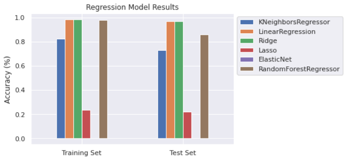

# ML4SCI-NMR Evaluation Tasks

## Introduction 

This repository contains the evaluation task results for the ML4SCI GSoC 2021 organization. The main task is to predict the parameters of a Magnetization curve that is observed during the Spin-Echo of a particular material. These parameters can be used later to classify the material based on its electronic properties. I have taken the liberty to split the evaluation task into two parts, namely: 
1. Building simple ML models for regression. 
   * The jupyter-notebook is available at `ml4sci_NMR_eval_1.ipynb` and the .html can be viewed [here](https://htmlpreview.github.io/?https://github.com/Anantha-Rao12/ML4SCI-NMR-evaltasks/blob/main/ml4sci_NMR_eval_1.html)
2. Building simple ANN models for regression.
    * The jupyter-notebook is available at `ML4SCI_NMR_evaltest_2.ipynb` and the .html can be viewed [here](https://htmlpreview.github.io/?https://github.com/Anantha-Rao12/ML4SCI-NMR-evaltasks/blob/main/ML4SCI_NMR_evaltest_2.html)

### Sample Results

